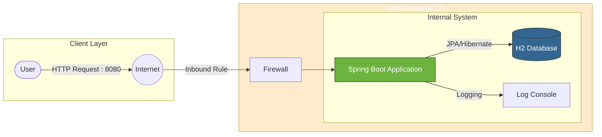
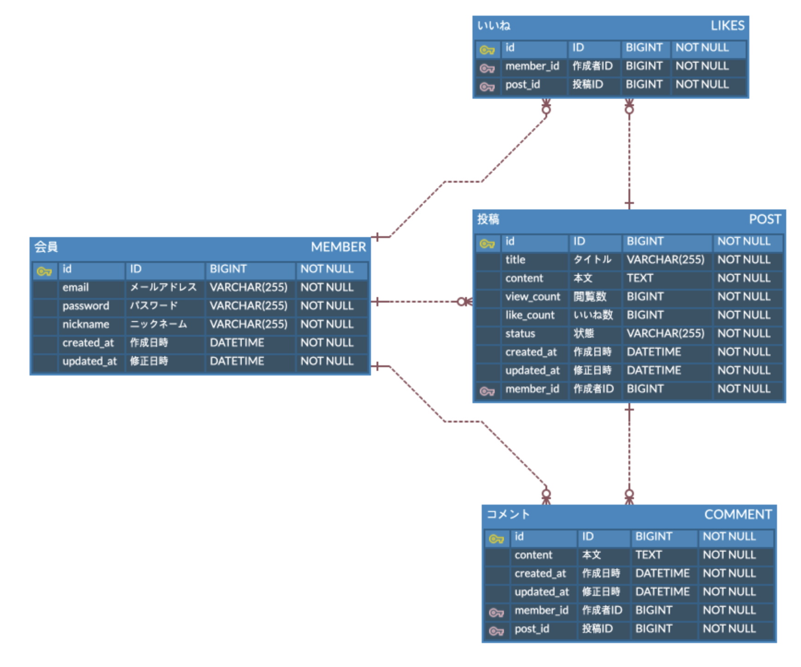

# 📌 Standard Board Service (基本に忠実な掲示板)

## 1. プロジェクト概要 (Project Overview)

- **目的:** Java/Spring Bootのコア技術を活用し、**保守性と拡張性**を考慮したバックエンドシステムを構築
- **コアバリュー (Core Values):**
    - **安定性 (Stability):** 例外処理およびデータの整合性を保証
    - **可読性 (Readability):** 日本の実務標準に合わせたパッケージ構成およびコード規約の遵守
    - **オブジェクト指向 (OOP):** JPAを活用したドメイン駆動設計 (DDD)

## 2. 技術スタック (Tech Stack)

- **Language:** Java 17
- **Framework:** Spring Boot 3.5.9
- **Database:** H2 (Develop) / MySQL (Production - 予定)
- **ORM:** Spring Data JPA
- **Template Engine:** Thymeleaf
- **Tool:** IntelliJ IDEA, Gradle, Git

---

## 🏗️ システムアーキテクチャ (System Architecture)

AWS EC2(Linux)環境にデプロイされ、H2 Databaseを使用してデータを管理する構造です。

---

## 3. 機能仕様 (Functional Specifications)

### 👤 会員 (Member)

1. **会員登録:** メールアドレス(ID)、パスワード、ニックネーム入力 (バリデーションチェック含む)
2. **ログイン/ログアウト:** セッション(Session)ベースの認証システム
3. **会員情報の修正:** 本人のみ修正可能

### 📝 投稿 (Post)

1. **投稿作成:** ログインした会員のみ作成可能
2. **投稿照会:** ページネーション(Paging)処理された一覧照会および詳細照会
3. **投稿修正/削除:** 作成者本人のみ可能
    - **特記事項:** データの保存のため、**「論理削除 (Logical Deletion)」**を適用

---

## 4. DB設計 (ERD)

### 🏗 設計意図 (Design Concept)

- **BaseEntityの活用:** 作成日時(`created_at`)、修正日時(`updated_at`)を共通管理し、重複コードを削除
- **論理削除 (Soft Delete):** `status`カラムを設け、誤って削除されたデータを復旧できるよう安全装置を用意
- **データの整合性:** 参照整合性(FK)および`NOT NULL`制約を厳格に適用

### 📊 テーブル構造

#### [Member Table] - 会員 (Member)

| Column Name | Type     | Key | Description             |
|-------------|----------|-----|-------------------------|
| member_id   | Long     | PK  | 会員固有ID (Auto Increment) |
| email       | Varchar  | UK  | ログインID (メール形式)          |
| password    | Varchar  |     | 暗号化されたパスワード             |
| nickname    | Varchar  |     | ニックネーム                  |
| created_at  | DateTime |     | 加入日時                    |
| updated_at  | DateTime |     | 情報修正日時                  |

#### [Post Table] - 投稿 (Post)

| Column Name | Type     | Key | Description                      |
|-------------|----------|-----|----------------------------------|
| post_id     | Long     | PK  | 投稿固有ID                           |
| title       | Varchar  |     | タイトル                             |
| content     | Text     |     | 本文 (大容量)                         |
| view_count  | Long     |     | 閲覧数 (Default 0)                  |
| like_count  | Integer  |     | いいね数 (Default 0)                 |
| status      | Varchar  |     | 状態 (ACTIVE, DELETED) - **論理削除用** |
| member_id   | Long     | FK  | 作成者ID (Member.id)                |
| created_at  | DateTime |     | 作成日時                             |
| updated_at  | DateTime |     | 修正日時                             |

#### [Comment Table] - コメント (Comment)

| Column Name | Type     | Key | Description       |
|-------------|----------|-----|-------------------|
| comment_id  | Long     | PK  | コメント固有ID          |
| content     | Text     |     | コメント本文            |
| member_id   | Long     | FK  | 作成者ID (Member.id) |
| post_id     | Long     | FK  | 投稿ID (Post.id)    |
| created_at  | DateTime |     | 作成日時              |
| updated_at  | DateTime |     | 修正日時              |

#### [Likes Table] - いいね (Likes)

| Column Name | Type | Key | Description       |
|-------------|------|-----|-------------------|
| likes_id    | Long | PK  | いいね固有ID           |
| member_id   | Long | FK  | 作成者ID (Member.id) |
| post_id     | Long | FK  | 投稿ID (Post.id)    |
